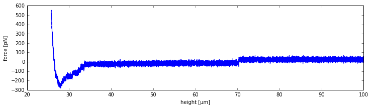

User Guide
==========

The CellHesion Class
--------------------

This is the main data-class that provides all functionality to load, analyze and display a single JPK CellHesion200
force file archive.

Attributes
~~~~~~~~~~

The following attributes are available:

- archive: an instance of :class:`~JPKay.core.data_structures.ForceArchive`
- properties: an instance of :class:`~JPKay.core.data_structures.Properties`
- data: :class:`pandas:pandas.DataFrame`

ForceArchive Attribute
~~~~~~~~~~~~~~~~~~~~~~

This is the internal jpk-force file archive handling object and should only be used to re-load data. This can be
achieved via :func:`~JPKay.core.data_structures.CellHesion.load_data`, for example:

>>> jpk_file = r'path/to/jpk-force/file'
>>> sample = CellHesion(force_file=jpk_file)
>>> sample.data.retract.force = pd.Series(np.random.rand(10))
>>> sample.load_data()

For more info, see :class:`~JPKay.core.data_structures.ForceArchive`.

Properties Attribute
~~~~~~~~~~~~~~~~~~~~

>>> jpk_file = r'path/to/jpk-force/file'
>>> sample = CellHesion(force_file=jpk_file)
>>> print(sample.properties.units["vDeflection"])
V
>>> print(sample.properties.general["timestamp"])
2014-12-11 18:19:11 UTC+0000
>>> print(sample.properties.segments['retract']['force-segment-header.num-points'])
78635
>>> print(sample.properties.segments['contact']['name_jpk'])
pause-at-end

For more info, see :class:`~JPKay.core.data_structures.Properties`.

Data Attribute
~~~~~~~~~~~~~~

The data segments are called:

- approach: cantilever approaches sample
- contact: cantilever is in contact with the sample
- retract: cantilever retracts from the sample
- pause: cantilever pauses between consecutive probings

Each segment holds both the force and height signal respectively. The force signal is in units of Newton (N),
the height signal is in units of Meter (m).

+---------+-------+--------+-------+--------+-------+--------+-------+--------+
| segment | approach       | contact        | retract        | pause          |
+---------+-------+--------+-------+--------+-------+--------+-------+--------+
| channel | force | height | force | height | force | height | force | height |
+=========+=======+========+=======+========+=======+========+=======+========+
| 0       | 4e-11 | 0.0001 | 5e-11 | 0.0001 | 5e-11 | 0.0001 | 4e-11 | 0.0001 |
+---------+-------+--------+-------+--------+-------+--------+-------+--------+
| ...     |  ...  |  ...   |  ...  |  ...   |  ...  |  ...   |  ...  |  ...   |
+---------+-------+--------+-------+--------+-------+--------+-------+--------+

The DataFrame has a hierarchical MultiIndex as column names and can be filled/edited with data using both
standard DataFrame column indexing methods ``sample.data.retract.force`` or ``sample.data['retract']['force']``.

>>> jpk_file = r'path/to/jpk-force/file'
>>> sample = CellHesion(force_file=jpk_file)
>>> sample.data.retract.force = pd.Series(np.random.rand(10))
>>> sample.data['retract']['force'] = pd.Series(np.random.rand(10))

Example Usage
~~~~~~~~~~~~~

>>> jpk_file = r'path/to/jpk-force/file'
>>> sample = CellHesion(force_file=jpk_file)
>>> import matplotlib.pyplot as plt
>>> x = sample.data.retract.height * 10**6
>>> y = sample.data.retract.force * 10**12
>>> plt.plot(x, y)
>>> plt.xlabel("height [µm]"); plt.ylabel("force [pN]")

